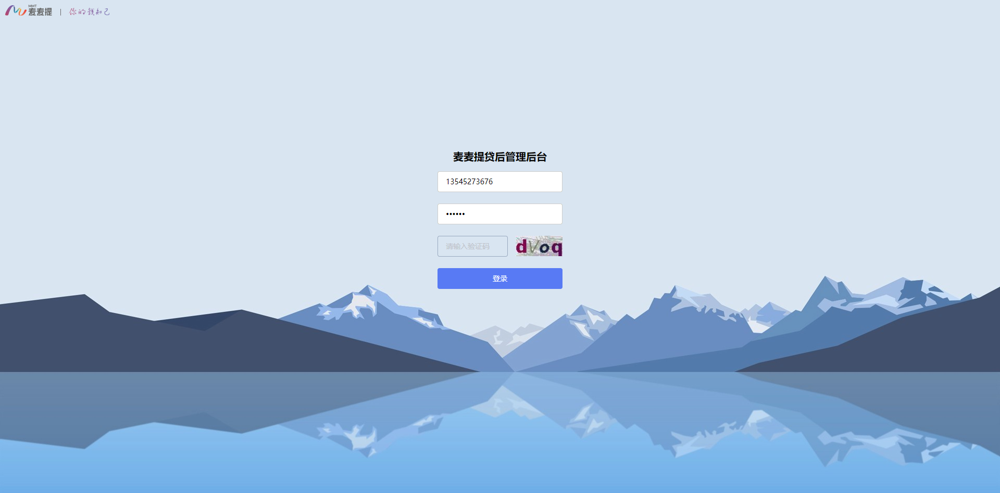
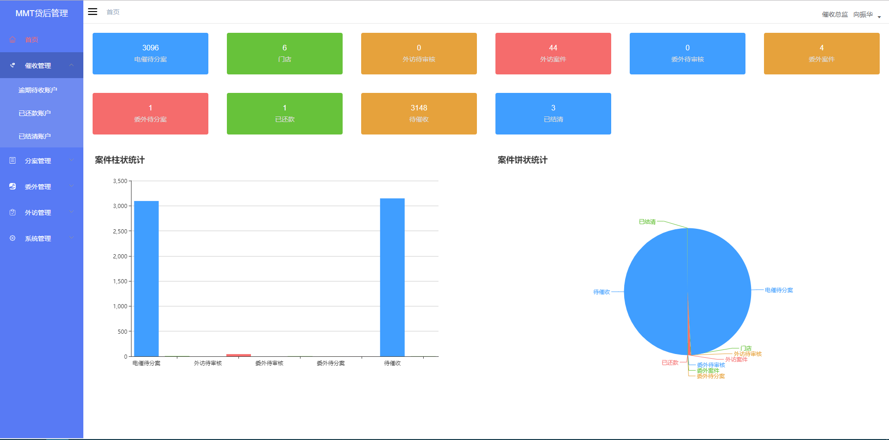
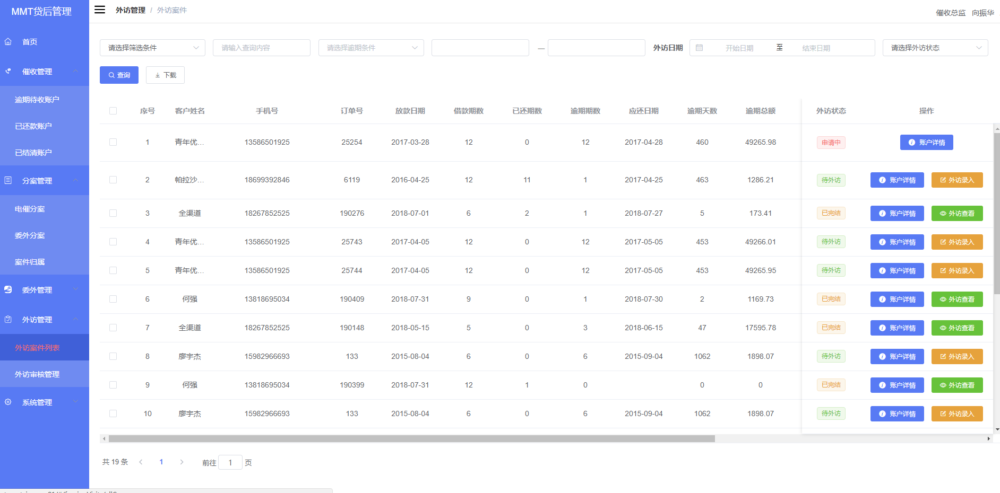

<center style="font-size:25px;">管理系统前端说明文档</center >

## 构建步骤

```bash

# Clone project
git clone https://github.com/hisey/vue-admin-demo.git

# Install dependencies
npm install

# serve with hot reload at localhost:9528
npm run dev

# build for production with minification
npm run build:prod

# build for test with minification
npm run build:test

# build for production and view the bundle analyzer report
npm run build --report
```

## 技术栈

[vue](https://cn.vuejs.org/) + [babel](http://babeljs.io/) + [webpack](http://webpack.github.io/) + [es6](http://es6.ruanyifeng.com/)


## ui 组件库

[elementUI](http://element.eleme.io/#/zh-CN)<br>


## 测试地址

<!-- [浏览器打开](http://test.demovip.com:81)<br> -->

## 部分界面展示

<!--  -->
<!--  -->
<!--  -->
<!--  -->

## 项目结构

```bash
│  .babelrc
│  .editorconfig
│  .eslintignore
│  .eslintrc.js
│  .gitignore
│  .postcssrc.js
│  favicon.ico
│  gulpfile.js
│  index.html
│  LICENSE
│  package.json
│  README.md
│  sftpConfig.js
│
├─icon                        # README.md里面的图标.
│      add.png
│      bable.png
│      element.png
│      es6.png
│      vue.png
│      webpack.png
│
├─src                        # 源码路径
│  │  App.vue                # 入口vue文件
│  │  main.js                # 入口js 文件
│  │  permission.js          # 权限文件
│  │
│  ├─api                     # api管理
│  │      login.js
│  │      user.js
│  │
│  ├─assets                  # 静态文件（会被打包）
│  │  ├─404_images
│  │  │      404.png
│  │  │      404_cloud.png
│  │  │
│  │  └─images
│  │         login-bg.jpg
│  │
│  ├─components              # 项目ui组件
│  │  ├─Breadcrumb
│  │  │      index.vue
│  │  │
│  │  ├─Hamburger
│  │  │      index.vue
│  │  │
│  │  └─SvgIcon
│  │         index.vue
│  │
│  ├─filters              # 全局过滤器
│  │      index.js
│  │
│  ├─icons                # 项目所使用的图标
│  │  │  index.js
│  │  │
│  │  └─svg
│  │     example.svg
│  │     eye.svg
│  │     form.svg
│  │     home.svg
│  │     password.svg
│  │     role.svg
│  │     table.svg
│  │     tree.svg
│  │     urgeIncome.svg
│  │     user.svg
│  │     users.svg
│  │
│  ├─router               # 路由配置
│  │      index.js
│  │
│  ├─store                # store配置
│  │  │  getters.js
│  │  │  index.js
│  │  │
│  │  └─modules
│  │          app.js
│  │          user.js
│  │
│  ├─styles              # 全局样式
│  │      element-ui.scss
│  │      index.scss
│  │      mixin.scss
│  │      sidebar.scss
│  │      transition.scss
│  │      variables.scss
│  │
│  ├─utils              # 所需工具集
│  │      auth.js
│  │      env.js
│  │      fetch.js
│  │      index.js
│  │      validate.js
│  │
│  └─views               # 页面文件
│      │  404.vue
│      │
│      ├─layout          # 所需的layout
│      │  │  Layout.vue
│      │  │
│      │  ├─components
│      │  │  │  AppMain.vue
│      │  │  │  index.js
│      │  │  │  Navbar.vue
│      │  │  │
│      │  │  └─Sidebar
│      │  │          index.vue
│      │  │          SidebarItem.vue
│      │  │
│      │  └─mixin
│      │          ResizeHandler.js
│      │
│      ├─login           # 登录
│      │      index.vue
│
└─static                # 静态文件（不需要打包）
        .gitkeep
```
