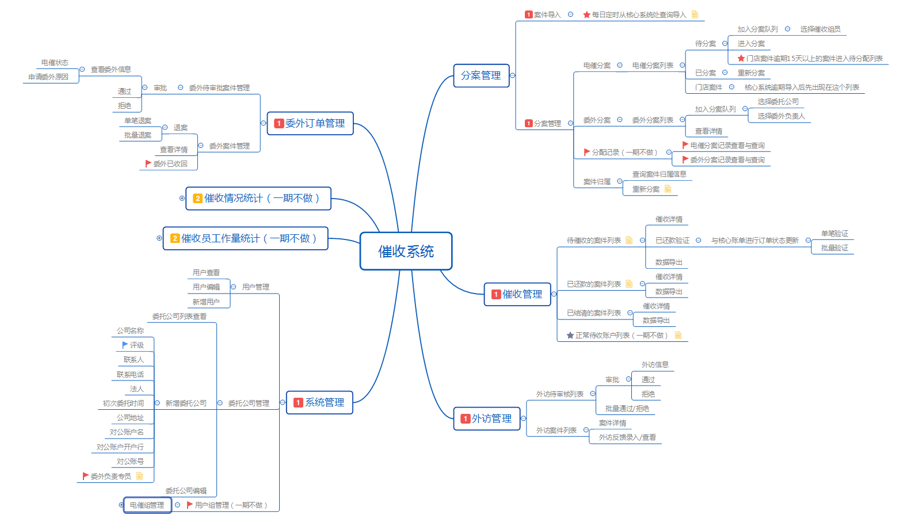
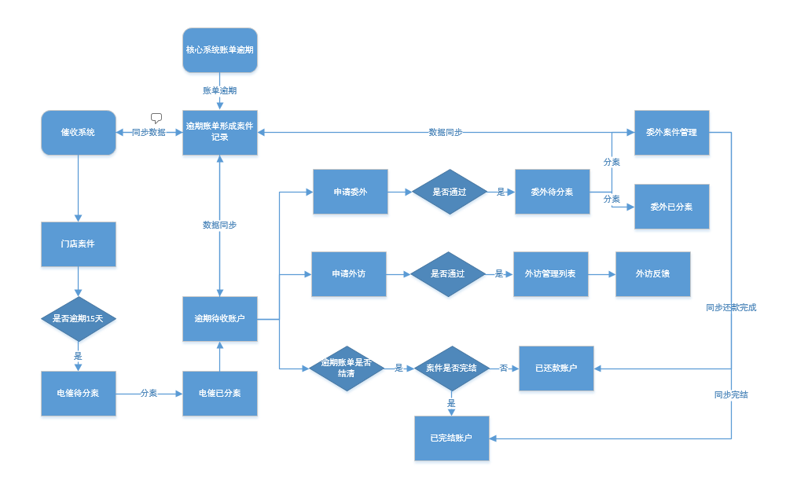

## 需求概述
贷后催收部目前是基于门店系统的催收模块进行催收操作，但是由于原版不是按照他们需求定制，在获取字段的时候效率比较低（新增字段）
不利于权限控制，催收兼有业务模块的权限（新增角色，催收经理）
催收模式不同，目前的贷后催收团队是以一个订单号作为一个数据单元进行催收，而系统这是以账单进行催收
后续对于催收权限、外访、委外的需求还有深入的规划
 独立系统建议：
平台账单催收一直没有独立的系统支持，目前核心系统和普惠系统都带着催收的功能，造成了数据显示分散
催收与业务在同一个系统的话，会造成迭代绑定，和相互影响
权限会更加的复杂
需求针对用户：
贷后催收部门（不同组织架构）
门店的业务员

## 软件结构

## 核心功能流程图

## 设计模式
**mvvm**  

 
