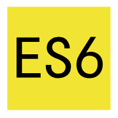

## 项目背景
该系统的名称为管理系统，该需求是按管理部门提出，由产品部设计，技术部小组开发，该项目的开发模式为前后端分离

## 定义
**webpack node npm es6**

## 参考资料
* [项目原型及开发资料](https://owecuz.axshare.com/#g=1&p=%E9%A6%96%E9%A1%B5)
* [bug及需求管理后台](https://bug.pgyer.com/cloud/#/projects)
* [产品预览地址](http://demo.jonuy.cn:81)

## 技术栈

[vue](https://cn.vuejs.org/) + [bable](http://babeljs.io/) + [webpack](http://webpack.github.io/) + [es6](http://es6.ruanyifeng.com/)

&nbsp;&nbsp;&nbsp;&nbsp;&nbsp;

&nbsp;&nbsp;&nbsp;&nbsp;&nbsp;

&nbsp;&nbsp;&nbsp;&nbsp;&nbsp;

&nbsp;&nbsp;&nbsp;&nbsp;&nbsp;

## ui组件库

[elementUI](http://element.eleme.io/#/zh-CN) 
 